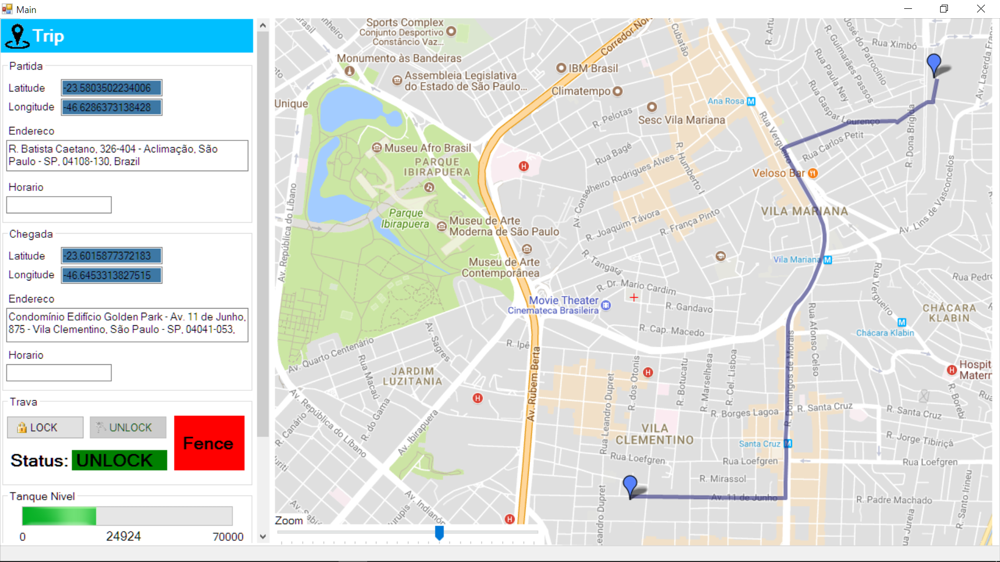
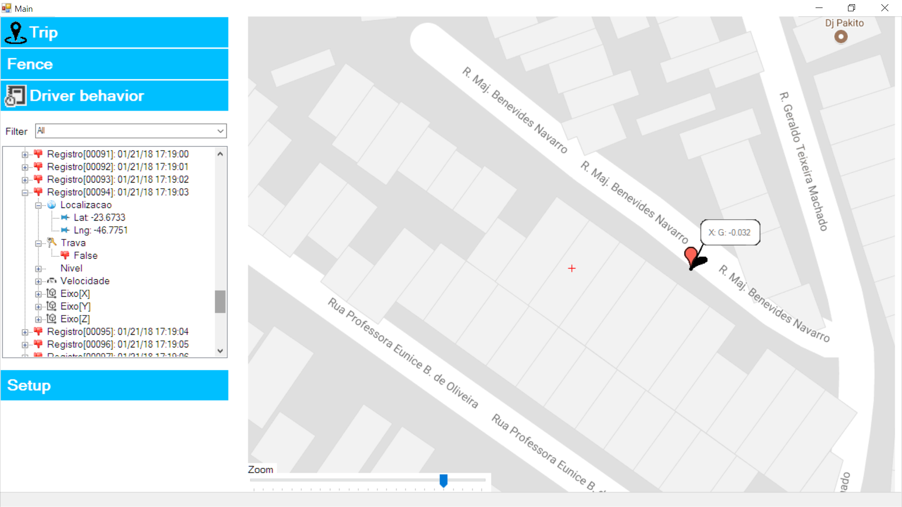

# GTracker

O objetivo desse projeto é desenvolver uma plataforma web que relaciona valores coletados de telemetria veicular (acelerômetros, GPS, ...) a eficiência enérgica do veículo com o modo de condução (acelerações e frenagens bruscas) e o tráfico das vias da região. 

### Objetivos adicionais
Comparar diferentes tipos de serialização de payload  (JSON, BJSON e CBOR) e seus impactos no consumo de banda e latência  

## Comunicação 
Foram implementados 2 tipos de comunicação serial (RS 232) e via broker de mensagens (rabbitmq). Para a camada de domínio a comunicação é
realizada por meio de um gerenciador de dispositivos que abstrai a uma mesma interface, sendo assim, é totalmente transparente a forma de comunicação para esse layer.

## Embarcado firmware ARM M0+:
Utilização do FreeRTOS com filas de mensagens para troca de informações entre as tasks e sinalizado através de TaskNotification. 
A comunicação via UART com o Host é totalmente assíncrona. O device possui tasks independentes para recepção e transmissão. Após recepção e validação do frame o payload é postado em uma fila de entrada e sinalizado para a task da camada de aplicação que fará o consumo e o processamento respectivo. Se algum processamento da camada de aplicação gerar alguma resposta que deve ser transmitida para o host. Essa resposta será colocada em uma fila de saída para a camada de comunicação fazer o empacotamento e envio. 
Por ser tratar de eventos assíncronos os frames possuem um timestamp para controle de sequência. Todo o firmware está orientado a eventos

## Embarcado firmware ESP32:
Basicamente o firmware do ESP32 é aprnas um bdrige UART<>WiFI. Não possui nenhuma logica de negócio.

### RTC
O RTC é ajustado automaticamente através de informações do GPS (Protocolo NMEA)

### Buffer circular
A recepção e envio ,de bytes nas postas seriais, são feitas utilizando interrupção e buffer circulare *ringbuffer*.
Como transceptor Wifi\BT\BLE está sendo utilizando o ESP32 que também possui um RTOS(FreeRTOS). Futuro será colocar um módulo GPRS para redes móveis e processar a pilha de conexão também no ESP32.
Apesar do ESP32 ser mais que um transceiver o custo permite utiliza-lo apenas para essa finalidade

## SW Web
Backend: Django com utilização de Channel , abstração de websocket , para atualizações, em tempo real do frontend (Bootstrap+JS+CSS+Chart.js).
Message Broker: RabbitMQ com o protocolo AMQP e MQTT
Google maps API

## SW Nativo
No diretório GoodsTracker é possível encontrar uma versão nativa do SW em linguagem C#.

Quando o usuario indica 2 pontos no mapa(clicando) uma rota é devolvida conforme mostra a figura abaixo.

O usuário pode contruir uma cerca eletrôncia onde onde será sinalizado caso a posição que o GPS indique uma localização fora.
Pode-se contruir inúmeras cercas compostas por inúmeros pontos 

Todo o histórico de telemetria é mantido e mostrado para o usuário em forma de treeview

É possivel habilitar e desabilitar os layers e também configurar o tipos de comunicação

## Ambiente de desenvolvimento

### Editores 

VS Code for linux, nano

### IDEs

MCUXPresso,Eclipse, Visual Studio

### Monitors network

sniffer - wireshark

trafic - Ntopng

## Configuração

### Ports
      
| Port | Aplicação       | socket      | url             |
|------|-----------------|-------------|-----------------|
|15672 |RabbitMQ adm     |             
|1883  |MQTT             |
|3000  |ntopng           |
|8000  |gtracker.com     |              | gtracker.com   |
|8020  |Daphne           | daphne.sock  |                |
|8010  |uwsgi            | gtracker.sock|                |
|5432  |gtracker-data    |              |                |
|      |ldap adm         |              | /phpldapadmin/ |
